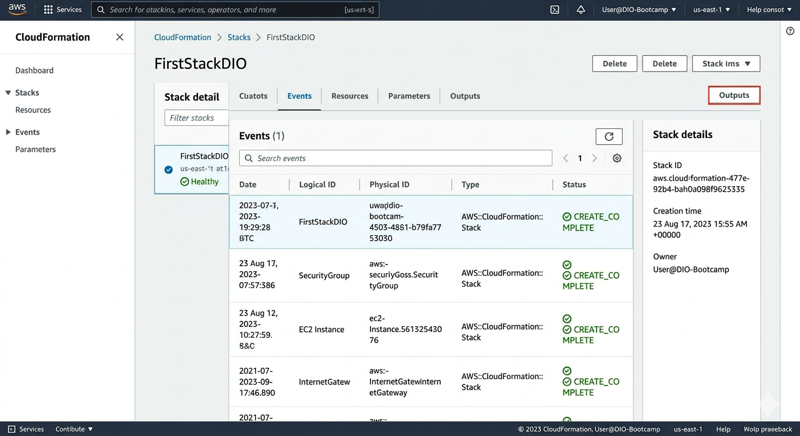
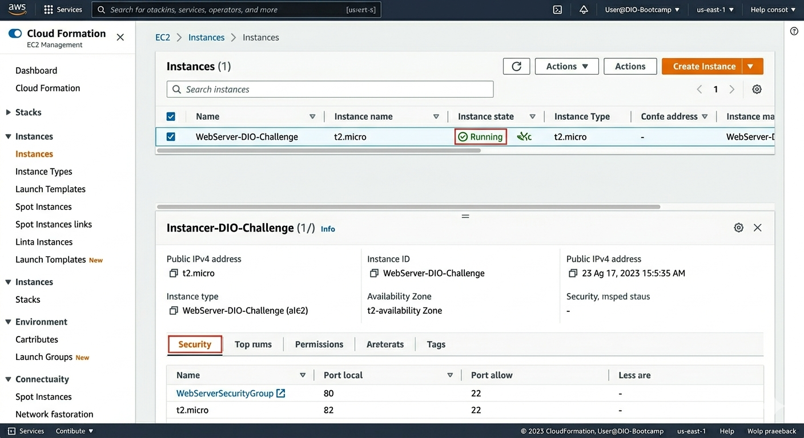

# Implementando minha Primeira Stack com AWS CloudFormation 🚀

Este repositório foi desenvolvido para documentar e entregar o desafio de projeto do bootcamp da DIO. O objetivo principal é praticar o conceito de **Infraestrutura como Código (IaC)**, automatizando o provisionamento de recursos na AWS de forma segura, repetível e padronizada.

---

## 🧠 Conceitos Aprendidos

Durante o desenvolvimento deste laboratório, foram consolidados os seguintes conceitos:
* **Infraestrutura como Código (IaC):** Gerenciamento de recursos de infraestrutura por meio de arquivos de configuração textuais, eliminando cliques manuais e reduzindo erros operacionais.
* **Templates CloudFormation:** Uso de arquivos declarativos em formato **YAML** para descrever o estado desejado dos recursos AWS.
* **Stacks (Pilhas):** Agrupamento de recursos relacionados que podem ser criados, atualizados ou excluídos de forma unificada e controlada.
* **Automação de Inicialização (User Data):** Execução de scripts automáticos no momento do boot da instância para instalar dependências e inicializar serviços sem intervenção humana.

---

## 🛠️ Arquitetura e Recursos Provisionados

O template desenvolvido (`templates/ec2-webserver.yaml`) automatiza a criação de um ambiente de servidor web funcional:

1. **AWS::EC2::SecurityGroup (Firewall):** 
   * Porta `80` (HTTP) aberta para qualquer origem (`0.0.0.0/0`), permitindo o acesso público ao site.
   * Porta `22` (SSH) configurada para permitir acessos de gerência.
2. **AWS::EC2::Instance (Servidor Web):**
   * Instância EC2 configurada dinamicamente com o **Amazon Linux 2023**.
   * Script *UserData* integrado para atualizar o sistema, instalar o servidor Apache (`httpd`), iniciar o serviço e criar uma página de boas-vindas customizada.

---

## 📸 Evidências do Provisionamento

Abaixo estão os registros visuais do sucesso da implementação no console AWS:

### 1. Stack Criada com Sucesso (CloudFormation)
O painel de eventos demonstra que todos os recursos foram criados na ordem correta, atingindo o status de `CREATE_COMPLETE`.

### 2. Instância EC2 Ativa e Executando
O console do EC2 confirma o provisionamento da máquina com o respectivo Security Group atrelado e o status `Running`.

---

## 🚀 Passo a Passo para Execução

1. **Preparação:** Faça o download do arquivo `ec2-webserver.yaml` localizado na pasta `templates` deste repositório.
2. **Console AWS:** Acesse o console da AWS e navegue até o serviço **CloudFormation**.
3. **Criar Stack:** Clique em **Create stack** (with new resources).
4. **Upload do Código:** Selecione *Template is ready*, escolha *Upload a template file* e envie o arquivo `.yaml`.
5. **Parâmetros:** 
   * Defina o nome da sua Stack (ex: `Stack-Webserver-DIO`).
   * Escolha o tipo de instância (o padrão é `t2.micro`, elegível para o nível gratuito).
   * Avance pelas próximas telas mantendo as opções padrão.
6. **Finalização:** Clique em **Submit**. Acompanhe a aba *Events* até que o status mude para `CREATE_COMPLETE`.
7. **Acesso Web:** Vá até a aba **Outputs** da Stack criada, copie a URL gerada e cole no seu navegador para ver o servidor Apache funcionando.

> ⚠️ **Importante:** Após concluir os testes e validar o desafio, lembre-se de selecionar a Stack no console do CloudFormation e clicar em **Delete**. Isso garante que todos os recursos sejam destruídos automaticamente, evitando custos desnecessários na sua conta.

---

## 🔗 Referências Úteis
* [AWS CloudFormation - Documentação Oficial](https://docs.aws.amazon.com/cloudformation/)
* [Amazon Linux 2023 - User Guide](https://docs.aws.amazon.com/linux/al2023/ug/what-is-al2023.html)
